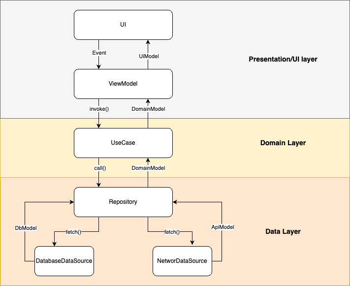
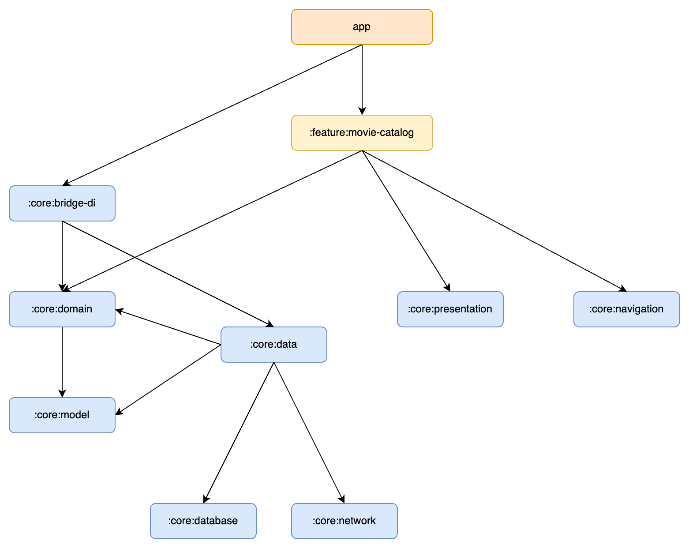

# Android Template Project

[](https://github.com/pantstamp/android-template-project/actions/workflows/build.yml)
[](https://kotlinlang.org)
[](https://developer.android.com/jetpack/compose)
[](https://developer.android.com/)
[](LICENSE)

This repository contains a template project that demonstrates how to implement a modern Android app. The project is written entirely in Kotlin, follows a multi-module structure, and uses Jetpack Compose for the UI while adhering to Clean Architecture principles.

The focus of this project is not to showcase the full capabilities of Jetpack Compose but rather to provide a suggestion for building an extensible and maintainable app using the latest Android libraries and tools.

This template is suitable for both small and large applications.

## Architecture
The **Android Template** app follows the Clean Architecture principles
and is described in detail in the
[architecture page](docs/ARCHITECTURE.md).



## Modularization
The **Android Template** app has been fully modularized. The modularization strategy is described in detail in the
[modularization page](docs/MODULARIZATION.md).

The project is split into **30 Gradle modules**. Feature modules depend only on core modules and
never on each other; core modules never depend on features. Every infrastructure concern is an
`api` module plus an implementation and a `noop` (network, database, logging), so implementations
can be swapped or stubbed per build. All module configuration comes from **12 convention plugins**
in `build-logic` — no module configures Android or Kotlin directly.



## Architecture Tests

The architectural rules above are not just documentation — they are executable. The `:test:konsist`
module fails the build when a rule is broken, for example when:

- a ViewModel takes a repository directly instead of a use case
- a `RepositoryImpl` has no corresponding `RepositoryImplTest`
- an `ApiModel` is not a `@Serializable data class` with `@SerialName` on every property

```bash
./gradlew :test:konsist:test
```

Alongside these there are **158 unit tests** using JUnit4, Truth, Turbine and Mockative.

## Building the Project

To build this project, you'll need to have the following setup:

- **JDK**:
Gradle runs on **JDK 21**. The JDK used to compile the project is downloaded automatically by the
Gradle toolchain resolver, so no particular JDK installation is required for that.

- **TMDB API Integration**:
This project uses the TMDB API for backend calls to fetch movie-related data. To use the API, you must register for an API key on the [TMDB Developer Portal](https://developer.themoviedb.org/docs/getting-started).

- **Adding the API Key**:
Once you have your TMDB API key, add the **API Read Access Token** by adding this line to your local.properties file (found in the root of your project): `TMDB_API_KEY=your_tmdb_read_access_token_here`

- **Build & Run**:
After adding the API Read Access Token, you can build and run the project as usual through Android Studio.

### Verification

```bash
./gradlew test                 # unit tests
./gradlew :test:konsist:test   # architecture rules
./gradlew spotlessCheck        # formatting (spotlessApply to fix)
./gradlew lint                 # Android Lint
```

All of the above run on every pull request via GitHub Actions.

## Toolchain

| | |
|---|---|
| Kotlin | 2.4.20 |
| Gradle | 9.5.1 |
| Android Gradle Plugin | 8.13.2 |
| Java | 21 to run Gradle, 17 target |
| compileSdk / targetSdk | 36 |
| minSdk | 24 |
| DI | Koin 4.2.2 |
| Network | Retrofit 3 + OkHttp 5 + kotlinx.serialization |
| Database | Room 2.8.5 |
| Images | Coil 3 |

All versions live in [`gradle/libs.versions.toml`](gradle/libs.versions.toml).

### Versions held back on purpose

Two dependencies are deliberately not on their latest release. Both have a defined exit condition.

**Android Gradle Plugin stays on 8.x.** AGP 9 requires either its built-in Kotlin support — which
KSP does not yet work with — or the deprecated `android.newDsl=false` escape hatch, removed in
AGP 10. Room and Mockative both depend on KSP, so the only working AGP 9 configuration needs two
deprecated flags and behaves exactly like AGP 8 anyway. The full spike, including the AGP 9 API
changes to apply later, is kept on the `chore/agp9-experiment` branch.

As a consequence, five libraries are one minor version behind latest (Compose, Lifecycle,
Navigation, Coil, OkHttp), because their newest releases declare `minCompileSdk=37`.

**Mockative stays on 2.x.** Mockative 3 replaced KSP code generation with runtime bytecode mocking
and a Gradle plugin; `@Mock`, `mock()`, `every` and `verify` no longer exist. Migrating means
rewriting the entire test suite against a new API for no functional gain.

## Contributing

The branch model, CI gates and release process are described in
[CONTRIBUTING.md](CONTRIBUTING.md).

## Roadmap

The template is complete and buildable as it stands — everything below is about breadth, not
missing foundations. The toolchain is kept current, and every change goes through the full
build, test, architecture and lint gates described above.

Planned next:

- Instrumented UI tests for the Compose screens
- A second feature module, to demonstrate feature-to-feature isolation in practice
- Migration to AGP 9 once KSP supports its built-in Kotlin
- Expanded documentation of the MVI and mapper conventions

## License

[MIT](LICENSE)
