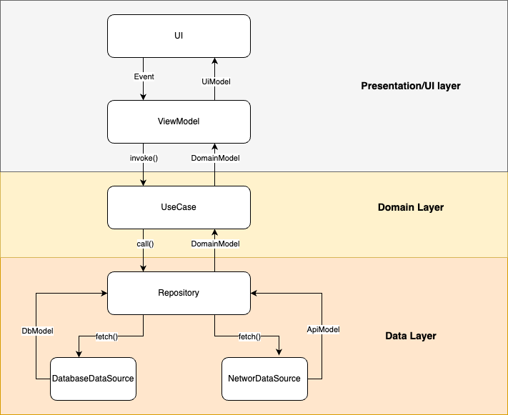
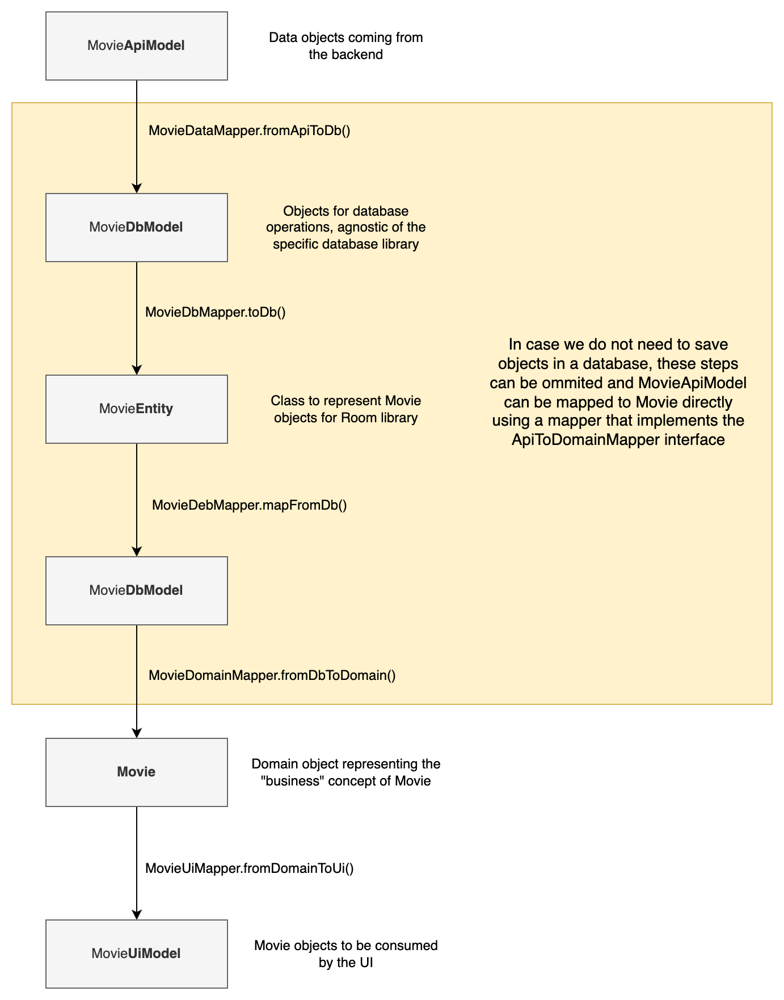

# Architecture

Here you will explore the architecture of the Android Template app, including its layers, key classes, and how they interact with each other.

## Architecture overview

The app architecture has three layers: a data layer, a domain layer and a Presentation or UI layer following the principles of Clean Architecture.

### Why Clean Architecture?

* Separation of Concerns: Code is separated into different modules or sections with specific responsibilities, making it easier to maintain and modify.
* Loose Coupling: The code is flexible, and changes can be made without affecting the entire system.
* Easily Testable: The architecture supports straightforward testing.

## Presentation/UI Layer

The Presentation/UI layer contains:

*   UI elements built using Jetpack Compose.
*   Android ViewModels

ViewModels collect data streams from use cases and convert them into a form suitable for the UI (ViewState). The UI displays this data and offers ways for users to engage with the app. User interactions are sent back to the ViewModel as events, where they are handled and processed.

Presentation/UI layer follows an implementation of the **MVI pattern**.  

### Modeling UI state

UI state is modeled as immutable data classes. 

ViewModels gather data streams, typically as cold flows, from a single or multiple use cases. These streams are either combined or mapped to create a single flow of UI state. This flow is transformed into a hot flow using a StateFlow, allowing UI components to access the latest known state directly from the flow.

### Processing user interactions

User actions are communicated from UI elements to ViewModels using events. Each screen has its own unique sealed interface to represent all the different kinds of events that can be triggered. ViewModels know how to handle each of these events.

## Domain Layer

The domain layer consists of use case classes, each of which has a single callable method (operator fun invoke) that encapsulates business logic.

These use cases help streamline ViewModels by eliminating redundant logic.They allow business logic to be reused in different parts of the app. They typically aggregate and manipulate data from repositories.

## Data Layer

The data layer is responsible for handling data sources and managing how data is fetched, stored, and accessed. It acts as a bridge between the domain layer (which contains the business logic) and external data sources such as APIs, databases, or local storage.

It currently contains a DatabaseDataSource, which is implemented using the Room library and serves as the single source of truth for the app's data. It also contains a NetworkDataSource that fetches data from the network using the Retrofit library.

Data sources are not exposed directly to the domain layer. They are hidden behind a repository abstraction. Each repository is responsible for determining how data is fetched and from which source. They also determine the caching policy.

## Flow of data objects between the Clean Architecture layers

To keep each layer as isolated as possible and avoid leaking implementation details from one to another, we should use different data objects for each layer. This means we need to transform the data from the time it arrives from the backend API until it reaches the UI for display.

In each layer, we use specific mapper objects. To maintain consistency, these mappers should implement specific interfaces that reside in the "architecture" module.

## Feature modules with their own Clean layers

A very common scenario we might encounter is implementing a new feature with functionality that is significantly different from the rest of the app. We should think of feature modules as small, independent apps that can be removed from the project without affecting other modules. In this case, the feature might have its own unique data sources, such as custom Retrofit services that interact with different backend systems than the rest of the app, its own database, unique repositories, and use cases with business logic that we are certain will never be used by other feature modules. They may also have their own domain models. All these classes should never reside in the :core modules. So, what should we do?

There are two recommended approaches:

- For smaller and simpler apps, follow a package-based approach. Create new packages inside the feature module to represent the Clean Architecture layers. For example, create a data package for all repository implementations, a domain package for all use cases and repository interfaces, a database package for all database-related classes, etc. It is important to remain consistent with the conventions used in the core modules.

- For larger projects that require maximum configurability, you could create a Gradle module structure for the feature, where each layer is represented by its own Gradle module, similar to how modules exist in the core package. However, this approach adds complexity and should be avoided for smaller projects, as it can be considered over-engineering.
