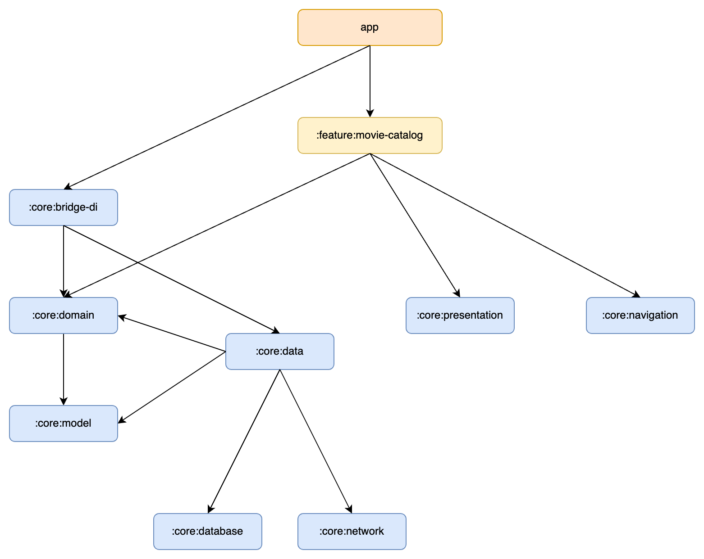

# Modularization

Here you will explore the modularization strategy of the Android Template app.

### Why Multi-Module?

* Developers can work on specific sections of the application without slowing down other developers.
* Maintainability: All files are organized in their respective modules, making it easier to locate what we're looking for.
* Incremental Compilation: Modifying a file allows modularized apps to compile faster compared to monolithic apps.
* CI/CD processes run faster.

### Modules in Android Template App

* The **app module** serves as the foundation for the application, encompassing app-level and scaffolding components that connect the rest of the codebase. It has dependencies on all feature modules and necessary core modules.
* **Feature modules** are designed to manage specific responsibilities within the app and are scoped accordingly. These modules remain distinct and self-contained. Classes that are only relevant to a single feature module should remain within it, whereas shared functionality should be moved to the appropriate core module. Feature modules are independent and **do not rely on other feature modules**, but only on the core modules they require.
* **Core modules** are shared library modules that house auxiliary code and specific dependencies meant to be utilized across various parts of the app. These modules may depend on other core modules but should not have dependencies on feature or app modules. Additionally, some core modules are designed to implement specific layers of the Clean Architecture framework, ensuring clear separation of concerns and promoting reusability throughout the codebase.
* **Miscellaneous modules**, such as :architecture and :utils, serve specific purposes and can be utilized by any other module.

